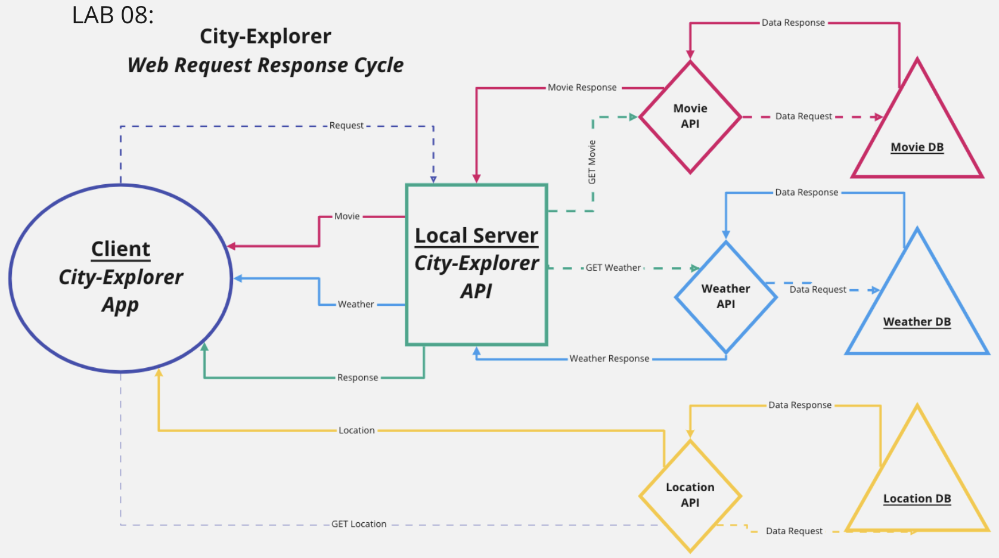

# City Explorer

**Author**: Erik Savage
**Version**: 1.0.0 (increment the patch/fix version number if you make more commits past your first submission)

## Overview
<!-- Provide a high level overview of what this application is and why you are building it, beyond the fact that it's an assignment for this class. (i.e. What's your problem domain?) -->
City-Explorer will allow a user to search for a location (city name) and return local relevent information such as, location name, latitude, longitude, map of the area, weather, and movies.

## Getting Started
<!-- What are the steps that a user must take in order to build this app on their own machine and get it running? -->

## Architecture
<!-- Provide a detailed description of the application design. What technologies (languages, libraries, etc) you're using, and any other relevant design information. -->

Technologies:
- HTML5
- CSS3
- JavaScript
- React
- Bootstrap
- LocationIQ API
- 
- Netlify Hosting

### Lab 08

### Lab 07

### Lab 06

## Change Log
<!-- Use this area to document the iterative changes made to your application as each feature is successfully implemented. Use time stamps. Here's an example:

01-01-2001 4:59pm - Application now has a fully-functional express server, with a GET route for the location resource. -->
- 12-08-2021 - Application is now hosted on Heroku
- 12-08-2021 - Application now has GET routes established to a movie and weather resource
- 12-07-2021 - Fully functional express server working with test weather data rendering
- 12-06-2021 - Application now has GET routes established to locatino resource and rendering

## Credit and Collaborations
<!-- Give credit (and a link) to other people or resources that helped you build this application. -->
- Andrew Enyeart
- Dani